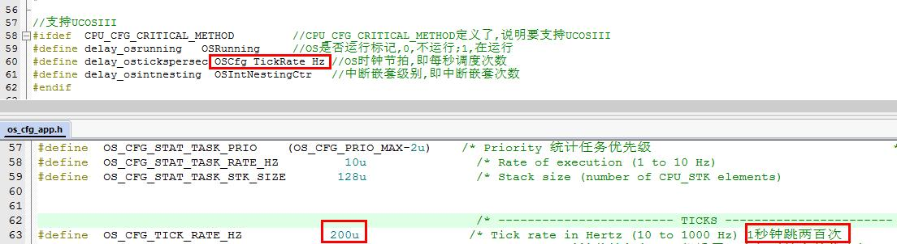
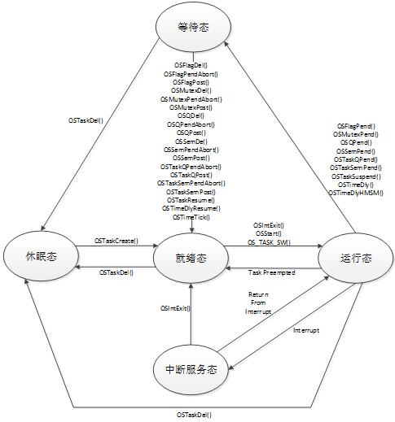

# this is a UCOS_practice_text

## 一、操作系统的相关内容
###  1、通常把程序分为两部分：前台系统和后台系统。  
简单的小系统通常是前后台系统，这样的程序包括一个死循环和若干个中断服务程序：应用程序是一个无限循环，循环中调用API函数完成所需的操作，这个大循环就叫做后台系统。中断服务程序用于处理系统的异步，也就是前台系统。前台是中断级，后台是任务级。

### 2、实时操作系统又分为硬实时和软实时。   
硬实时要求在规定的时间内必须完成操作 ，硬实时系统不允许超时，在软实时里面处理过程超时的后果就没有那么严格。

### 3、RTOS操作系统：UCOS，FreeRTOS，RTX，RT-Thread，DJYOS等。

 ### 4、RTOS操作系统的核心内容在于：实时内核。  
 UCOS的内核是可剥夺型的，可剥夺内核顾名思义就是可以剥夺其他任务的CPU使用权，它总是运行就绪任务中的优先级最高的那个任务。其中，数字越小，优先级越高。
 
 

 ### 5、UCOS目前有两个版本：UCOSII和UCOSIII。   
UCOSIII是一个可裁剪、可剥夺型的多任务内核，而且没有任务数限制。UCOSIII提供实时操作系统所需的所有功能，包括资源管理、同步、任务通信等。  UCOSIII是用C和汇编来写的，其中绝大部分都是用C语言编写的，只有极少数的与处理器密切相关的部分代码才是用汇编写的。

### 6、/ticks:延时的节拍数：1个节拍默认是5ms.   
当在UCOS上使用普通延时delay_us时，无法触发任务调度，当使用普通延时delay_ms(u16 ms)时，如果延时数小于系统周期，也无法发起任务调度。

### 7、UCOSIII中的任务由三部分组成：任务堆栈、任务控制块和任务函数。        
    任务堆栈：上下文切换的时候用来保存任务的工作环境，就是STM32的内部寄存器值。  
    任务控制块：任务控制块用来记录任务的各个属性。  
    任务函数：由用户编写的任务处理代码，是实实在在干活的。

### 8、UCOSIII默认有5个系统任务   
    1、空闲任务：UCOSIII创建的第一个任务，UCOSIII必须创建的任务，此任务有UCOSIII自动创建，不需要用户手动创建。  
    2、时钟节拍任务：此任务也是必须创建的任务。 
    3、统计任务：可选任务，用来统计CPU使用率和各个任务的堆栈使用量。此任务是可选任务，由宏OS_CFG_STAT_TASK_EN控制是否使用此任务。   
    4、定时任务：用来向用户提供定时服务，也是可选任务，由宏OS_CFG_TMR_EN控制是否使用此任务。    
    5、中断服务管理任务：可选任务，由宏OS_CFG_ISR_POST_DEFERRED_EN控制是否使用此任务。

### 9、UCOSIII有5种工作状态

## 二、任务堆栈
### 1、任务堆栈的创建
任务堆栈是任务的重要部分，堆栈是在RAM中按照“先进先出(FIFO)”的原则组织的一块连续的存储空间。为了满足任务切换和响应中断时保存CPU寄存器中的内容及任务调用其它函数时的需要，每个任务都应该有自己的堆栈。
任务堆栈创建很简单：    

    #define START_STK_SIZE 		512	//堆栈大小  
    CPU_STK START_TASK_STK[START_STK_SIZE];	//定义一个数组来作为任务堆栈
    
CPU_STK为CPU_INT32U类型，也就是unsigned int类型，为4字节的，那么任务堆栈START_TASK_STK的大小就为：512 X 4=2048字节!

### 2、任务堆栈初始化
<b>在创建一个新任务时</b>必须把系统启动这个任务时所需的CPU各个寄存器初始值事先存放在任务堆栈中。这样当任务获得CPU使用权时，就把任务堆栈的内容复制到CPU的各个寄存器，从而可以任务顺利地启动并运行。   
把任务初始数据存放到任务堆栈的工作就叫做任务堆栈的初始化，UCOSIII提供了完成堆栈初始化的函数：OSTaskStkInit()

  

